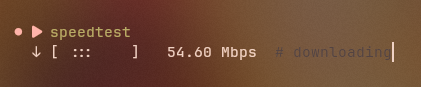

# SpeedTest

A minimal CLI internet speed tester written in Go with zero external dependencies.

## How it works

- **Ping** — sends HEAD requests to measure latency
- **Download** — parallel GET requests with configurable concurrency; bytes are counted incrementally for live speed updates
- **Upload** — parallel POST requests sending 64 KB random chunks
- All tests run for a fixed duration (default 5s) using `context.WithDeadline` to cut off in-flight requests

The animated progress bar uses a variable-size block of `:` that pulses left-to-right, showing data flow. The animation speed accelerates with throughput.

## Install

### Via install script
```sh
chmod +x install.sh && sudo ./install.sh
```

### Manual
```sh
go build -o speedtest .
sudo mv speedtest /usr/local/bin/
```

## Usage

```
speedtest [options]
```

### Options

| Flag | Default | Description |
|------|---------|-------------|
| `-duration` | `5` | Test duration in seconds |
| `-concurrent` | `4` | Parallel connections |
| `-dl` | *(see below)* | Download test URL |
| `-ping` | `https://www.google.com` | Latency test URL |
| `-ul` | `https://www.google.com` | Upload test URL |
| `-a` | `1` | Number of runs to average |
| `-B` | `false` | Display speeds in MB/s instead of Mbps |
| `-no-download` | `false` | Skip download test |
| `-no-upload` | `false` | Skip upload test |
| `-update` | `-` | update the script when installed globally |

Default download URL: `https://dl.google.com/linux/direct/google-chrome-stable_current_x86_64.rpm`

### Examples

```sh
# Single run with defaults
speedtest

# 10-second test with 8 concurrent connections
speedtest -duration 10 -concurrent 8

# Run 3 times and show averages
speedtest -a 3

# Show speeds in MB/s
speedtest -B

# Skip upload, show MB/s
speedtest -no-upload -B

# Custom server
speedtest -dl http://example.com/file.bin
```

## Project Structure

```
speedtest/
├── main.go        # CLI entry point, flag parsing, averaging loop
├── speedtest.go   # Core test logic (ping, download, upload)
├── ui.go          # Animated progress bar, speed formatting
├── install.sh     # Install script
├── go.mod         # Go module file
└── README.md      # This file
```

---
<p align="center">
  Made with ❤️ by <a href="https://github.com/wollydev24">WollyDev24</a>  | Copyright © 2026
</p>
